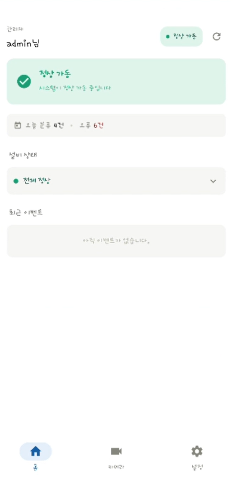
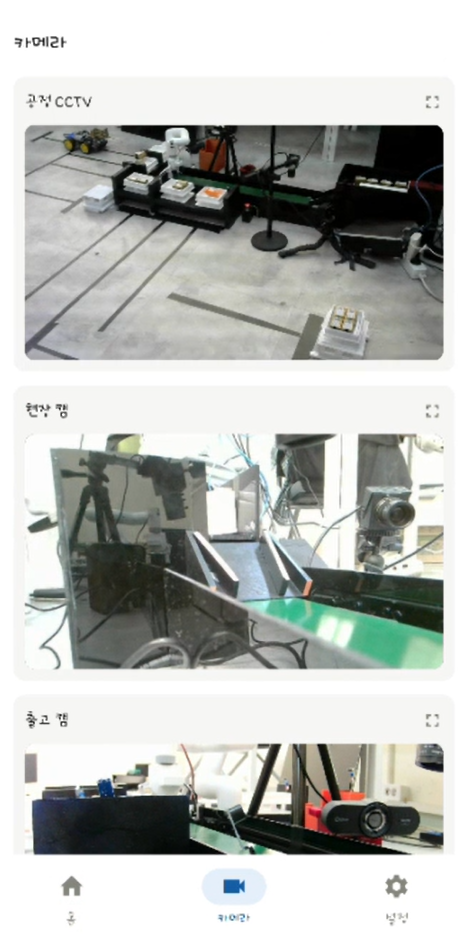
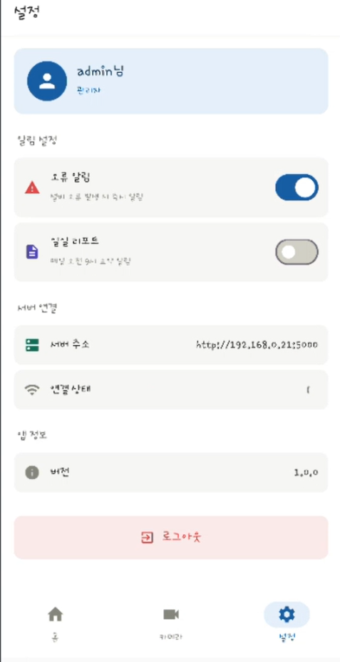
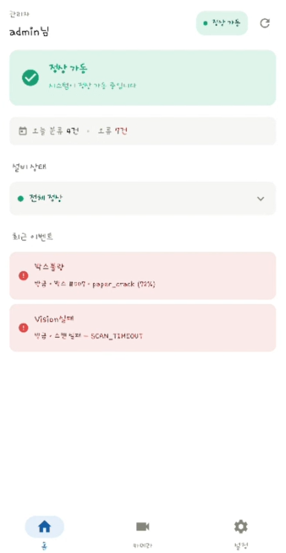
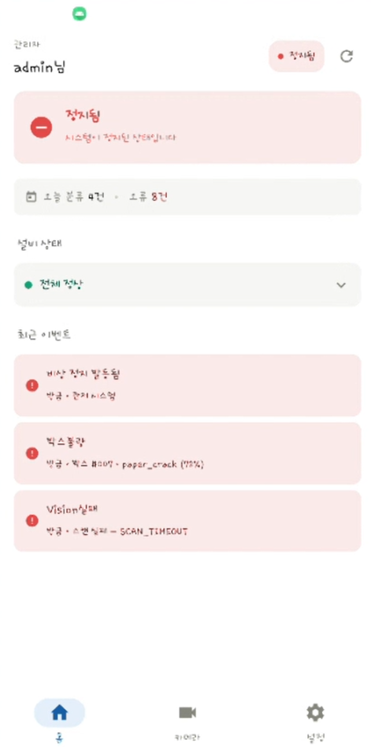

# 스마트 택배 분류 시스템 — Android 모니터링 앱

컨베이어 벨트 기반 스마트 택배 분류 시스템의 현장 상황을 실시간으로 모니터링하는 Android 앱입니다.
로봇팔, 리니어 액추에이터, OCR/QR 인식, 카메라 등으로 구성된 전체 분류 라인의 동작 상태와 이벤트를 한 화면에서 확인할 수 있습니다.

> 6인 팀 캡스톤 프로젝트 중 **Android 앱 개발**과 **기구 설계**를 담당했습니다.

---

## 📱 주요 화면

| 홈 | 카메라 | 설정 |
|----|--------|------|
|  |  |  |

홈 탭에서 장비 연결 상태와 분류 이벤트를 실시간으로 확인하고, 카메라 탭에서 현장/출고/CCTV 카메라 스트림을 보며, 설정 탭에서 알림 등을 관리합니다.

---

## ✨ 주요 기능

- **실시간 모니터링**: 분류 이벤트, 장비 연결/해제 상태를 앱 화면에서 즉시 확인
- **푸시 알림**: 앱이 백그라운드/종료 상태여도 비상정지·박스 불량 발생 시 알림 수신
- **카메라 스트림**: 현장캠·출고캠·CCTV 영상을 앱에서 직접 확인

| 불량 택배 감지 | 비상정지 로그 |
|----------------|----------------|
|  |  |

> 본 앱은 **읽기 전용 모니터링 전용**으로, 장비를 직접 제어하지 않습니다.

---

## 🛠 기술 스택

| 구분 | 사용 기술 |
|------|-----------|
| 언어 | Kotlin |
| UI | Jetpack Compose |
| 실시간 통신 | Socket.IO |
| 푸시 알림 | Firebase Cloud Messaging (FCM) |
| 이미지 로딩 | Coil |
| 로컬 저장 | DataStore |

---

## 🔗 시스템 구성

앱은 세 가지 경로로 서버와 통신합니다.

- **Socket.IO** — 앱이 켜져 있을 때 실시간으로 화면을 갱신 (분류 이벤트, 불량 검사, 비상정지, 장비 연결/해제)
- **FCM** — 앱이 꺼져 있을 때 푸시 알림 전달 (비상정지, 박스 불량)
- **카메라 스트림** — MJPEG 방식으로 현장/출고/CCTV 카메라 영상 수신 (별도 카메라 서버)

```
[분류 시스템 서버] ──Socket.IO──▶ [Android 앱]  실시간 화면 갱신
        │
        └──────────FCM────────▶ [Android 앱]  백그라운드 알림

[카메라 서버] ────MJPEG 스트림──▶ [Android 앱]  영상
```

> 폐쇄망 내부 IP 환경을 전제로 동작합니다.

---

## 🔧 기구 설계

앱 개발과 함께 분류 시스템의 기구 설계도 담당했습니다.
부품 선정 근거와 설계 의도는 [기구 설계 노트](mechanical/design-notes.md)에 정리했습니다.

- 택배 투입부: 리니어 액추에이터(LM4075-F) 선정
- 시간 기반 오픈루프 제어
- 투입 구간 고가 설계
- 설계 도구: Solid Edge 2026

---

## 📂 프로젝트 정보

| 항목 | 내용 |
|------|------|
| 기간 | 2026.05.12 ~ 2026.06.19 |
| 팀 구성 | 6인 팀 프로젝트 |
| 담당 파트 | Android 모니터링 앱 개발, 기구 설계 |
| 협업 파트 | Flask/Socket.IO 서버, WPF 데스크탑 앱, 카메라 서버 |

---

## 🎬 시연 영상

- **앱 시연** — https://youtu.be/HsPwBcji0j8
- 전체 시스템 시연 — https://youtu.be/iHXT4Knp-pQ
