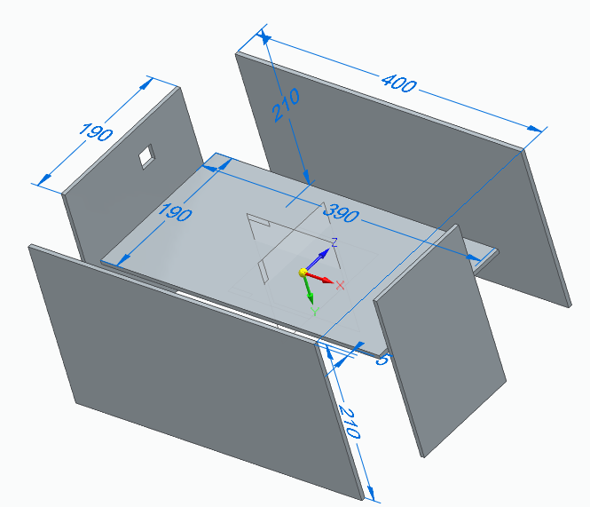
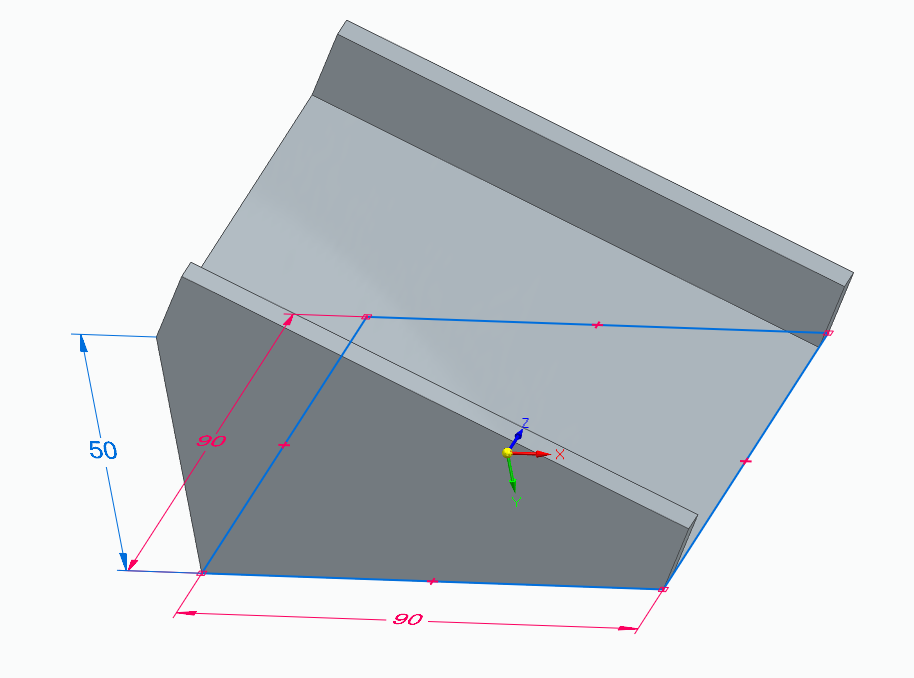
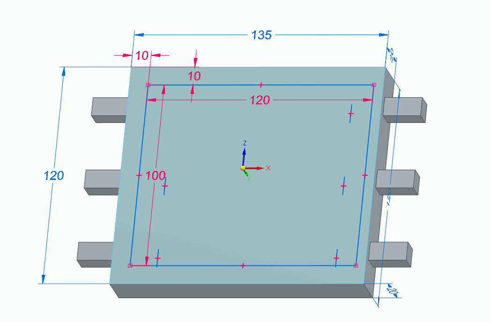
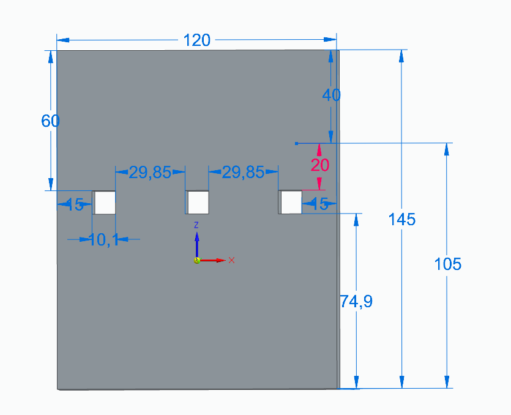

# 기구 설계 노트

스마트 택배 분류 시스템의 주요 기구 설계 의사결정을 정리한 문서입니다.
설계 도구: Solid Edge 2026

---

## 택배 투입부: 리니어 액추에이터(LM4075-F)

박스를 컨베이어로 밀어 넣는 직선 동작에는 회전식 서보모터보다 리니어 액추에이터가 적합하다고 판단했습니다. 미는 동작이 본질적으로 직선 운동이라 별도 변환 기구 없이 구조가 단순해지고, 약 250N의 추력으로 박스 무게와 마찰을 안정적으로 감당할 수 있습니다.

## 제어 방식: 오픈루프

투입부는 "밀고 → 돌아온다"는 단순 왕복만 반복하므로, 위치 센서 없이 시간 기반 오픈루프로 제어했습니다. 액추에이터의 기구적 스트로크 끝이 곧 정지 위치가 되어, 별도 센서 없이도 위치가 사실상 보장됩니다. 단순 동작에 센서·피드백을 더하는 것은 과한 설계로 보았습니다.

## 투입 구간 고가 설계

투입 구간을 높게 설계해, 박스가 일정한 자세로 진입하도록 유도하고 후단 OCR/QR 인식 정확도를 높이고자 했습니다. 높이 차를 활용해 무동력으로 다음 구간에 진입하도록 했고, 하부에 배선·부품 배치 공간을 확보하는 의도도 반영했습니다.

## 지지대 구조

투입 구간을 받치는 지지대는 바닥부와 측면부로 나누어 설계했습니다. 상부 구조물의 하중을 안정적으로 지지하면서, 하부 공간을 확보하도록 구성했습니다.

| 지지대 바닥 | 지지대 옆면 |
|-------------|-------------|
|  |  |
